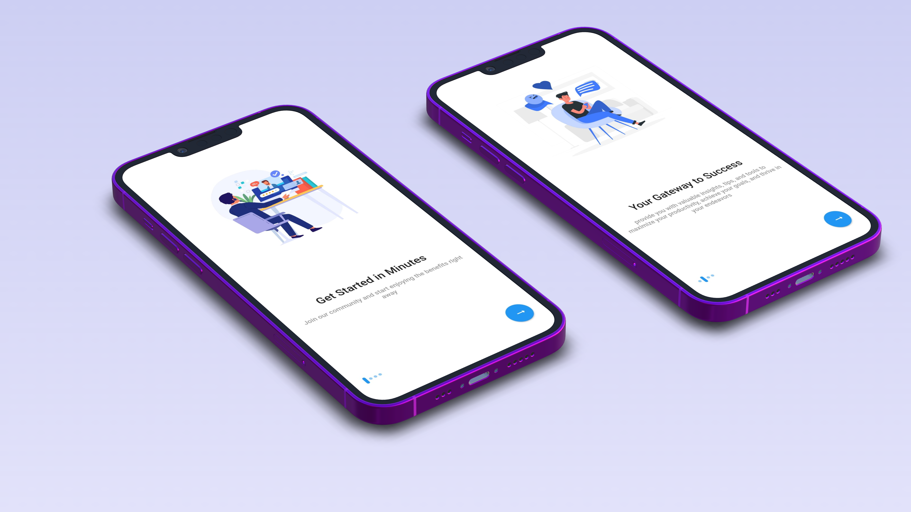

# Onboarding_Screen_UI
The Business Onboarding Screen project in Flutter is a user interface (UI) development project aimed at creating an intuitive and efficient onboarding process for businesses using the Flutter framework. The onboarding screen serves as the initial point of interaction for new business users, guiding them through the necessary steps to set up their accounts and access the platform's features. 

